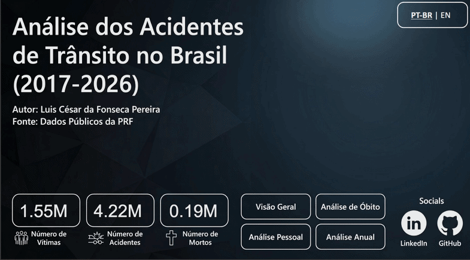
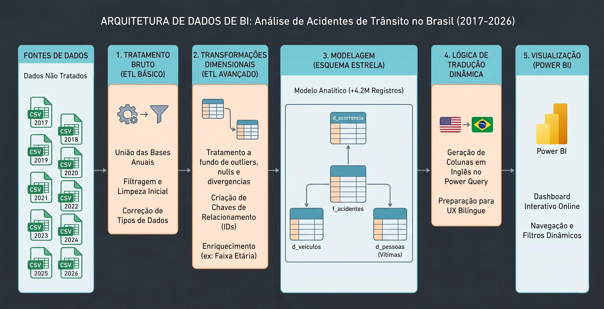
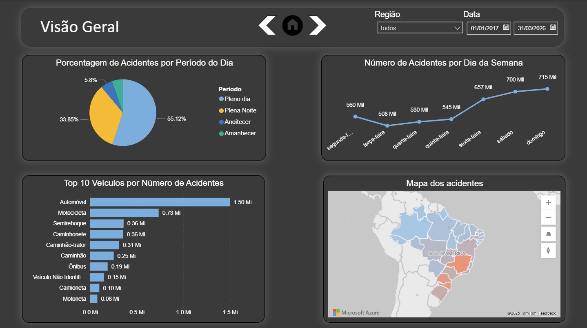
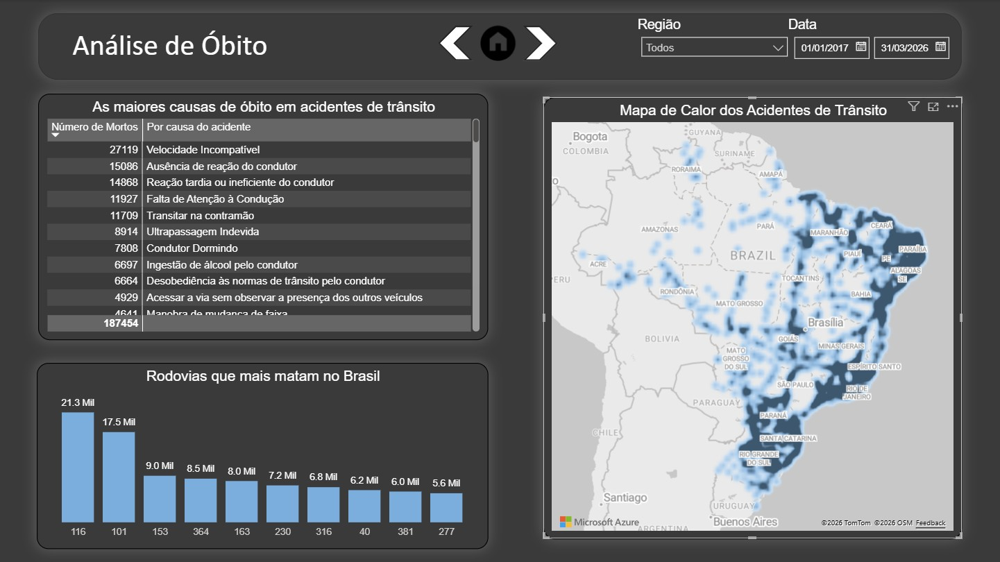
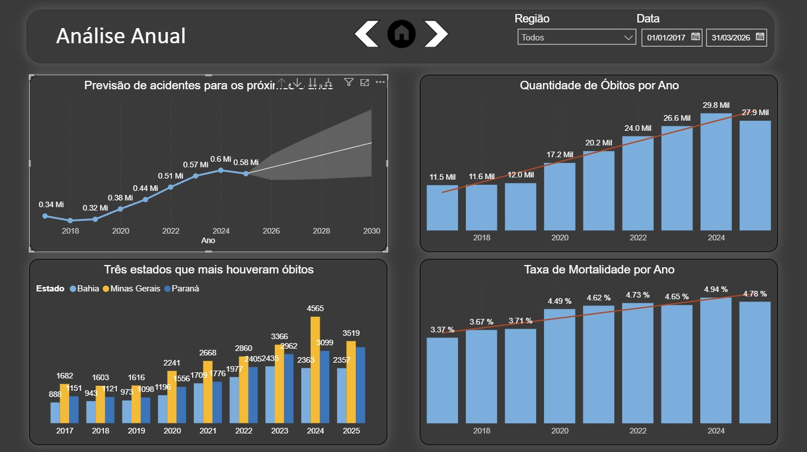
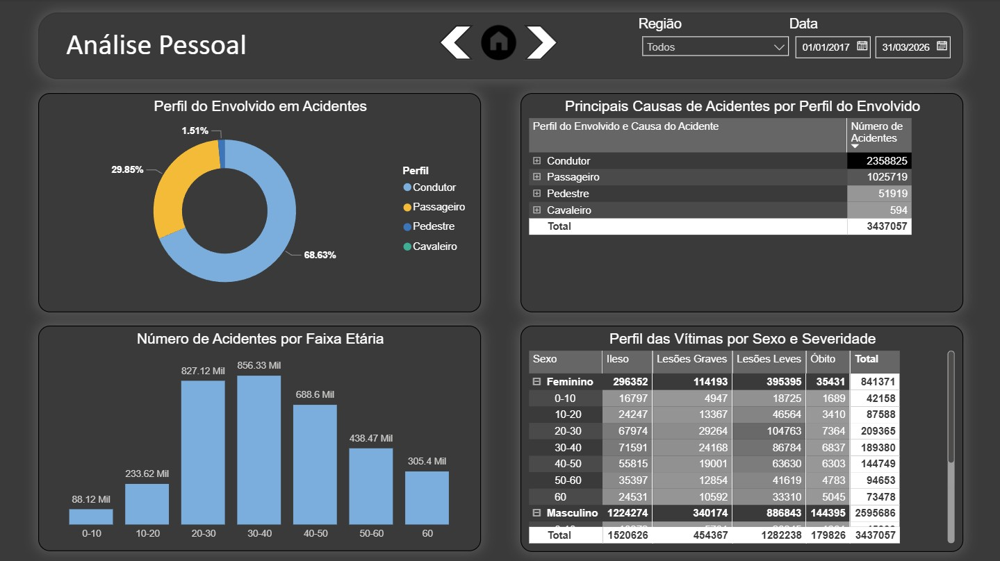

# Análise de Acidentes de Trânsito no Brasil (2017-2026)

### 🎬 Dashboard em Ação
  
*
Breve demonstração da interatividade, menu de navegação e troca dinâmica de idioma do dashboard.
*

---

### 📋 Resumo do Projeto

Este projeto apresenta uma análise detalhada dos acidentes de trânsito registrados pela [Polícia Rodoviária Federal (PRF)](https://www.gov.br/prf/pt-br/acesso-a-informacao/dados-abertos/dados-abertos-acidentes) entre 2017 e 2026. O objetivo primário foi consolidar, limpar e explorar esses dados para extrair insights reais e acionáveis sobre a segurança nas rodovias brasileiras.

Além do impacto social, **este dashboard atua como um caso de uso analítico universal**. Ele demonstra a capacidade como um profissional de dados em capturar milhões de registros brutos, estruturá-los e traduzi-los em recomendações estratégicas. A premissa aqui é clara: a habilidade de resolver problemas e otimizar processos é independente da origem dos dados. A arquitetura e a lógica de negócios aplicadas aqui a acidentes de trânsito poderiam, com a mesma eficiência, estar analisando incidentes operacionais de uma indústria, churn de clientes ou dados financeiros complexos.

Como grandes diferenciais técnicos, destaco a modelagem em **Esquema Estrela (Star Schema)** — essencial para garantir a alta performance ao processar uma base massiva com **mais de 4,2 milhões de registros** — e uma interface 100% bilíngue (PT/EN). Para que o relatório não perdesse velocidade com a troca de idiomas, desenvolvi rotinas otimizadas de transformação (ETL) que traduzem a base de forma dinâmica e sem travamentos.

---

### Acesso e Demonstração
A melhor forma de avaliar este projeto é navegando pela ferramenta:

* 🌐 **[Acessar o Dashboard Interativo Online](https://app.powerbi.com/view?r=eyJrIjoiODVkNjZlMzctYjJmMC00NTVkLTk2OGQtMGY0ZDNlOGYzMGQ0IiwidCI6IjlhOWIxZjg2LWJiYWYtNGUzOS1hN2RiLWY1ZmFlOTFlYTkyMiJ9&pageName=3d9bc5c7816faa48f258)**

---

### Perguntas Respondidas
O dashboard foi construído para responder a perguntas críticas, como:
1. Quais são os principais veículos, locais e horários dos acidentes?
2. Quais rodovias e causas de acidente apresentam maior risco de fatalidade?
3. Qual é o histórico do número de acidentes ao longo dos anos e qual a previsão estatística para o futuro?
4. Qual o perfil demográfico (sexo, idade) das vítimas e sua relação com a severidade do acidente?

---

### Ferramentas Utilizadas
* **Power BI:** Plataforma principal para todo o processo de ETL, modelagem e UX/UI.
* **Power Query (Linguagem M):** Para limpeza profunda, tratamento de erros, transformação e consolidação de dados massivos.
* **DAX:** Para a criação de medidas e colunas calculadas complexas (ex: Taxa de Mortalidade).
* **Cloudflare (DNS & Email Routing):** Para configuração de domínio corporativo próprio, permitindo a publicação pública segura no Power BI Service.

---

### Processo de ETL, Arquitetura e Modelagem
Os dados brutos, provenientes de múltiplos arquivos anuais da [Polícia Rodoviária Federal (PRF)](https://www.gov.br/prf/pt-br/acesso-a-informacao/dados-abertos/dados-abertos-acidentes), passaram por um rigoroso processo de engenharia de dados:

* **Consolidação:** Os arquivos CSV de 2017 a 2026 foram unificados em uma única base de dados massiva (`f_Acidentes`), servindo como fundação para a extração das dimensões e estruturação correta do modelo.
* **Modelagem Star Schema:** O modelo final foi desenhado com uma Tabela Fato (`f_Acidentes`) e três Dimensões (`d_Ocorrencia`, `d_Pessoas`, `d_Veiculos`), garantindo performance imediata nas consultas e filtros.
* **Limpeza e Transformação:** Tratamento de valores nulos, erros de conversão, remoção de outliers (ex: idades > 110 anos) e criação de colunas de enriquecimento, como `Faixa Etária`. *(Nota: Cálculos de proporção, como a Taxa de Mortalidade, foram desenvolvidos via linguagem DAX para manter a dinamicidade dos filtros).*
* **Dicionário via OCR e Tradução Otimizada:** As 91 causas distintas de acidentes possuíam diversas variações de texto. Para otimizar o tempo, extraí as categorias via OCR com API da DeepL via ShareX, realizei o tradução em lote pelo Google Translator, validei e implementei esse mapeamento no Power Query. Utilizei um script M avançado com a função `Record.FieldOrDefault`, que varre e traduz milhões de linhas para o inglês de forma automática e sem perda de performance.
* **UX/UI e Modo Bilíngue:** Implementação de uma navegação fluida (*App-like*) com botões de interface para alternância entre as páginas, além de um controle de idioma no menu que altera todo o contexto do dashboard (PT/EN) em tempo real.

---

### Principais Dashboards, Insights e Recomendações

### 1. Visão Geral

* **Insight 1:** Os fins de semana (sábado e domingo) concentram o maior volume absoluto de acidentes, impulsionados pelo aumento do fluxo de veículos de passeio e viagens de lazer.
* **Insight 2:** Mais da metade das ocorrências (55%) acontece durante o período diurno, com envolvimento majoritário de automóveis. Esse padrão temporal apresenta alta consistência em toda a série histórica analisada (2017-2026).
* **Recomendação Estratégica:** Revisão na alocação do efetivo policial e de radares móveis. Embora seja cultural no Brasil a intensificação de operações em feriados prolongados, os dados evidenciam a necessidade de manter um policiamento ostensivo e preventivo padronizado em **todos** os finais de semana comuns, mitigando o risco constante de acidentes.

### 2. Análise de Óbitos

* **Insight 1:** "Velocidade Incompatível" e "Falta de Atenção à Condução" despontam como as principais causas do Fator Humano em acidentes fatais.
* **Insight 2:** As rodovias BR-116 e BR-101 (principais eixos logísticos do país) se destacam com os maiores números absolutos de fatalidades no período analisado.
* **Insight 3:** A análise geográfica (Azure Heatmaps) revela uma altíssima concentração de ocorrências letais nos cinturões metropolitanos de Curitiba, Belo Horizonte e Recife.
* **Recomendação Estratégica:** Devido à vasta extensão territorial das BRs 116 e 101 (ambas com mais de 4.000 km), o patrulhamento ostensivo em toda a malha torna-se operacional e financeiramente inviável. No entanto, a inteligência geoespacial cruza o risco geográfico (regiões metropolitanas) com o comportamento de risco (excesso de velocidade). A recomendação é a implantação cirúrgica de radares de fiscalização eletrônica e redutores físicos nas aproximações destas capitais, aliada a campanhas de conscientização segmentadas por geolocalização (via apps de navegação) para alertar os motoristas ao ingressarem nesses trechos críticos.

  
### 3. Análise Anual e Preditiva

* **Insight 1:** O número absoluto de acidentes apresenta uma forte tendência histórica de alta. Embora os dados de 2025 mostrem uma retração pontual (queda de aproximadamente 200 mil acidentes em relação a 2024), o modelo preditivo aponta para a retomada do crescimento nos próximos anos.
* **Insight 2:** A Taxa de Mortalidade acompanha a linha de tendência ascendente. Isso indica que os acidentes não apenas estão mais frequentes no longo prazo, mas tornando-se progressivamente mais letais.
* **Insight 3:** Minas Gerais desponta como o principal estado de alerta logístico. A partir de 2020, o estado sofreu uma escalada no número de fatalidades, atingindo um pico crítico em 2024 (aumento de 1.119 óbitos frente a 2023). Para se ter dimensão, apenas o *aumento* registrado neste ano supera o *total* absoluto de óbitos do estado em 2017.
* **Recomendação Estratégica:** É crucial evitar que a queda pontual nos indicadores de 2025 gere um "falso otimismo" na gestão pública, visto que o modelo estatístico prevê a manutenção do viés de alta a longo prazo. Além disso, recomenda-se a criação de uma força-tarefa federal focada na tríade Minas Gerais, Bahia e Paraná — estados que lideram isoladamente o ranking de óbitos desde 2017. O objetivo deve ser uma investigação aprofundada de causa-raiz para entender as anomalias ou falhas de infraestrutura que fazem com que estados com características geográficas tão distintas apresentem, de forma consistente, os piores resultados do país.

### 4. Análise Demográfica (Perfil)

* **Insight 1:** A grande maioria das vítimas em sinistros de trânsito (68%) é composta pelos próprios condutores, seguidos pelos passageiros (29%).
* **Insight 2:** O cruzamento de dados entre o *Perfil do Envolvido* e a *Causa do Acidente* consolida a premissa de que o "Fator Humano" (especificamente a imprudência direta, como falta de atenção e excesso de velocidade) é o vetor central da letalidade, superando de forma absoluta os fatores climáticos, mecânicos ou de infraestrutura da via.
* **Insight 3:** A faixa etária de 20 a 40 anos (população jovem e economicamente ativa) representa, de longe, o grupo de risco mais crítico, acumulando mais de 1,6 milhão de registros. Em segundo lugar está o grupo de 40 a 50 anos, com 688 mil registros.
* **Recomendação Estratégica:** Transição do modelo atual de campanhas de trânsito genéricas para um modelo de comunicação pública baseado em dados (*Data-Driven Marketing*). Sabendo que o motorista entre 20 e 40 anos é o principal vetor de risco, as verbas de conscientização devem ser hiper-segmentadas para este público-alvo. Recomenda-se a criação de campanhas de impacto focadas em **auto-responsabilidade**, veiculadas prioritariamente em canais digitais, redes sociais e por meio de parcerias com aplicativos de mobilidade. O objetivo é expor as estatísticas reais diretamente ao condutor, deixando claro que sua própria performance na direção é o fator determinante entre a vida e a morte nas rodovias.

---
### Próximos Passos (Trabalhos Futuros)
Como a área de dados está em constante evolução, mapeei algumas melhorias técnicas que podem ser implementadas nas próximas versões deste projeto:
* **Machine Learning:** Integração com scripts em Python (Scikit-Learn) dentro do Power BI para criar um modelo de clusterização mais avançado das áreas de risco.
* **Acessibilidade:** Ampliar as opções de UX/UI com temas de alto contraste para usuários com deficiência visual.

### Contato e Conexões
Gostou da análise ou tem alguma sugestão de melhoria? Fique à vontade para se conectar comigo para conversarmos sobre dados, BI e tecnologia!

* 💼 **LinkedIn:** [Luis César da Fonseca Pereira](https://www.linkedin.com/in/luis-cesar-pereira/)
* 📧 **E-mail:** [cesar.pereira@lcinsights.com.br](mailto:cesar.pereira@lcinsights.com.br)

⭐️ *Se este projeto foi útil ou inspirador para você, não esqueça de deixar uma estrela neste repositório!*
